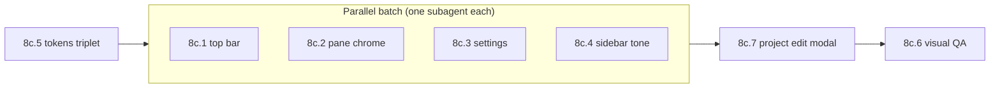

# Agent Task 8c: Moshtty UI Follow-up (M8b Reference Parity)

**Status:** Planned
**Owner:** (multiple — see sub-slices)
**Parent milestone:** M8 UI Refresh, M8b UI Polish
**Scope label:** `8c-ui-followup`

---

## Read First

Run the [Subagent Pre-flight](../../AGENTS.md#subagent-pre-flight) checklist **verbatim** before touching any file. That means: `git status`, `git log -1 --format='%h %s'`, confirm owned paths against [`OWNERS.md`](OWNERS.md). Then read:

- [`AGENTS.md`](../../AGENTS.md) — especially [Stop Conditions](../../AGENTS.md#stop-conditions), [Slice Budget](../../AGENTS.md#slice-budget), [Design Rules](../../AGENTS.md#design-rules).
- [`docs/moshtty-prd.md`](../moshtty-prd.md).
- [`docs/moshtty-design-system.md`](../moshtty-design-system.md) — token contract; every CSS value must reference a token from `apps/desktop/src/renderer/src/design/tokens.css`.
- [`docs/moshtty-design-references.md`](../moshtty-design-references.md).
- [`docs/visual-qa/8b/M8b-design-gap-assessment.md`](../visual-qa/8b/M8b-design-gap-assessment.md) — **read the Opus verification section at the bottom**; it lists every gap this brief addresses.
- The parent brief [`docs/agents/2026-05-27-8b-moshtty-ui-polish.md`](2026-05-27-8b-moshtty-ui-polish.md) for original context.

Reference images live in [`docs/visual-qa/8b/references/`](../visual-qa/8b/references/) (confirmed on disk). Primary refs for this brief:

- `opencode-tab-bar.png` — tab strip ground truth.
- `opencode-dashboard-light.png` — dashboard tone, sidebar rail.
- `opencode-settings-dialog.png`, `antigravity-settings.png` — settings layout.
- `opencode-project-edit-dialog.png` — project edit modal.
- `antigravity-main.png` — overall flat chrome.

---

## Background

M8b shipped as a narrow CSS patch. It does not achieve the reference parity the brief asked for. The Opus pass on 2026-05-27 (see audit doc) re-graded M8b to `In progress` and split the remaining work into the seven bounded sub-slices below. The goal of M8c is to close the ref-parity gap and the user-flagged interaction issues without expanding scope.

User-direct corrections that this brief encodes (2026-05-27 session):

1. Sidebar collapse icon is the **leftmost** icon in the top bar and uses a **panel-left** glyph, not a hamburger.
2. A separate overflow/menu icon sits immediately to the right of the sidebar toggle and stubs a contextual menu (menu itself is out of scope).
3. Tabs are **left-aligned** to the right of those icons (no centering).
4. Tabs have **more vertical padding** and the close `×` is **always visible**, not just on hover.
5. Pane controls and pane info live in **floating pills in the top corners**, visible only on hover. The persistent `pane-header` row goes away.
6. Terminal canvas fills the **full pane area**; no dark gutter below a light terminal.
7. The pencil icon on a sidebar project opens an **edit modal** instead of mounting an inline `<input>`.
8. Remove **superfluous spacer lines** wherever a `border-*` rule is decorative.

---

## Sub-slice map

Seven sub-slices. Each is a single atomic conventional commit. Coordinator picks ordering; the parallel-safety column tells the coordinator which can fan out.

| Sub-slice | Title                                                       | Owned paths                                                              | Parallel-safe with                                             |
| --------- | ----------------------------------------------------------- | ------------------------------------------------------------------------ | -------------------------------------------------------------- |
| 8c.1      | Top bar restructure + OpenCode tab strip                    | `TopBar.tsx`, `TopBar.css`, new `design/icons/index.tsx` additions       | 8c.2, 8c.3, 8c.4                                               |
| 8c.2      | Pane chrome → hover pills + full-area terminal              | `TerminalPane.tsx`, pane CSS in `assets/main.css`                        | 8c.1, 8c.3, 8c.4                                               |
| 8c.3      | Settings dialog discipline + working controls               | `Dialogs.tsx`, `Dialogs.css`                                             | 8c.1, 8c.2, 8c.4                                               |
| 8c.4      | Dashboard + sidebar tone (text only)                        | `Dashboard.tsx`, `Dashboard.css`, `Sidebar.tsx`/`.css` text-only         | 8c.1, 8c.2, 8c.3                                               |
| 8c.5      | Tokens stop-condition triplet (`--color-terminal-bg` light) | `design/tokens.css`, `design/tokens.ts`, `docs/moshtty-design-system.md` | **NOT parallel-safe**; coordinator-only; lands first           |
| 8c.7      | Project edit modal                                          | `dialogs.ts`, `Dialogs.tsx`, `Dialogs.css`, `Sidebar.tsx`, `Sidebar.css` | **NOT parallel-safe** with 8c.3 or 8c.4 — runs after both land |
| 8c.6      | Visual QA + baselines                                       | `apps/desktop/tests/visual/**`, `docs/visual-qa/8b/live-audit/**`        | runs **LAST**, after 8c.1–8c.5 and 8c.7                        |

Each sub-slice MUST stay inside the [Slice Budget](../../AGENTS.md#slice-budget): soft cap 8 changed files, hard cap 20.

---

## 8c.5 — Tokens stop-condition triplet (COORDINATOR-ONLY)

This sub-slice changes the design contract, which is a [Stop Condition](../../AGENTS.md#stop-conditions). Only the coordinator may land it. It runs **before** the other slices so baselines and pane backgrounds match the new terminal tone.

### Files

- `apps/desktop/src/renderer/src/design/tokens.css`
- `apps/desktop/src/renderer/src/design/tokens.ts`
- `docs/moshtty-design-system.md`

### Changes

1. `tokens.css` `:root[data-theme='light']` (and the default `:root` block that mirrors light):

   ```css
   --color-terminal-bg: #ffffff;
   --color-text-terminal: #1a1a1f;
   ```

   (Today these are `#1e1e24` / `#f0f0f4` — a dark terminal in a light shell. The reference is a white terminal in light mode.)

2. `tokens.ts`: mirror the same change in the light branch.

3. `docs/moshtty-design-system.md`: update the token table row for `--color-terminal-bg` and `--color-text-terminal`; add a one-line rationale ("light mode uses a white terminal canvas to match OpenCode/Antigravity references; dark mode unchanged").

### Verification

```bash
pnpm --filter @moshtty/desktop lint:css
pnpm --filter @moshtty/desktop typecheck
```

Visual baselines will be refreshed by 8c.6 — do **not** run `test:visual:update` in this slice.

### Commit shape

`chore(tokens): light terminal background follows app surface`

---

## 8c.1 — Top bar restructure + OpenCode tab strip

### Owned paths

- `apps/desktop/src/renderer/src/components/TopBar.tsx`
- `apps/desktop/src/renderer/src/components/TopBar.css`
- `apps/desktop/src/renderer/src/design/icons/index.tsx` (add **only** new icons; do not modify existing exports)

### Goal

Top bar reads as in [`opencode-tab-bar.png`](../visual-qa/8b/references/opencode-tab-bar.png): flat chrome (no bottom border), panel-left icon + overflow icon at the far left, tabs left-aligned right after the icons (not centered), inactive tabs bare with letter chip + hairline divider, active tab as a filled pill, close `×` always rendered.

### Concrete changes

#### Icons (`design/icons/index.tsx`)

Add two new exports next to `HamburgerIcon`:

```tsx
export const SidebarLeftIcon: React.FC<IconProps> = ({
  size = 18,
  color = "currentColor",
  ...props
}) => (
  <svg
    width={size}
    height={size}
    viewBox="0 0 24 24"
    fill="none"
    stroke={color}
    strokeWidth="2"
    strokeLinecap="round"
    strokeLinejoin="round"
    {...props}
  >
    <rect x="3" y="4" width="18" height="16" rx="2" />
    <line x1="9" y1="4" x2="9" y2="20" />
  </svg>
);

export const MoreIcon: React.FC<IconProps> = ({
  size = 18,
  color = "currentColor",
  ...props
}) => (
  <svg width={size} height={size} viewBox="0 0 24 24" fill={color} {...props}>
    <circle cx="5" cy="12" r="1.5" />
    <circle cx="12" cy="12" r="1.5" />
    <circle cx="19" cy="12" r="1.5" />
  </svg>
);
```

Keep `HamburgerIcon` exported — it is still imported by other files (`TopBar.tsx` is the only consumer per `rg "HamburgerIcon"`, but verify with `rg` before deleting any import).

#### `TopBar.tsx`

- Replace the `<HamburgerIcon size={16} />` inside the sidebar-toggle button with `<SidebarLeftIcon size={16} />`.
- Add a second icon button **right after** the sidebar toggle, inside `.top-bar-left`:

  ```tsx
  <button
    className="overflow-menu-btn"
    type="button"
    aria-label="Open menu"
    title="Menu"
    data-action-id="open-overflow-menu"
    onClick={() => {
      /* TODO(M8c follow-up): wire contextual menu */
    }}
  >
    <MoreIcon size={16} />
  </button>
  ```

- Move the entire `<div className="tab-strip-wrapper">` block **inside** `.top-bar-left`, immediately after the overflow button. The `.top-bar-right` block keeps `connection-status` + `WindowControls`.
- Final JSX skeleton:

  ```tsx
  <header className="top-bar" data-testid="top-bar">
    <div className="top-bar-left">
      <button className="sidebar-toggle" ...><SidebarLeftIcon size={16} /></button>
      <button className="overflow-menu-btn" ...><MoreIcon size={16} /></button>
      <div className="tab-strip-wrapper">
        <div className="tab-strip" role="tablist">...</div>
        <button className="new-tab-btn" ...><PlusIcon size={16} /></button>
      </div>
    </div>
    <div className="top-bar-right">
      <span className={`connection-status ${...}`}>{remoteStatus}</span>
      <WindowControls />
    </div>
  </header>
  ```

- Inside each `.tab-wrapper`, render a letter chip BEFORE the tab button. Pull the chip color and initial from the project that owns the tab. Use existing helpers:

  ```tsx
  // top of file
  import { projectDisplayInitial } from '../../../common/state'

  // inside tabs.map(...), before the `<button className="tab-btn">`:
  const tabProject = state?.projects.find((p) => p.tabIds.includes(tab.id)) ?? activeProject
  // render:
  <span className="tab-chip" style={{ backgroundColor: tabProject?.color }}>
    {tabProject ? projectDisplayInitial(tabProject) : 'M'}
  </span>
  ```

  The chip lives inside `.tab-wrapper` but outside `.tab-btn` (so the active-pill background hugs the title + close).

- The close `×` button must remain in the JSX for **every** tab (already the case when `tabs.length > 1`); do not gate visibility on `:hover` in CSS (see CSS changes).

#### `TopBar.css`

Replace the file with rules that achieve the following. Keep all values pointing at design tokens (Stylelint will reject raw values otherwise).

- `.top-bar`:
  - Drop `justify-content: space-between` — we now want `.top-bar-left` flex-growing and `.top-bar-right` snapped to the end. Replace with `justify-content: flex-start`.
  - **Remove the `border-bottom`** entirely.
  - Keep height, drag region, app-bg.

- `.top-bar-left`:
  - `flex: 1; min-width: 0;` so it can host the growing tab strip.
  - Keep gap to `var(--space-sm)`.

- `.overflow-menu-btn`: copy the `.sidebar-toggle` rules (same icon-button shape).

- `.tab-strip-wrapper`:
  - **Remove `max-width: 600px;` and `margin: 0 var(--space-lg);`.**
  - Keep `flex: 1; display: flex; align-items: stretch; height: 100%;`.
  - Add `min-width: 0;` for proper ellipsis behavior.

- `.tab-strip`: unchanged.

- `.tab-wrapper`:
  - Bump `padding: var(--space-xs) var(--space-sm);` to give the user-requested vertical padding.
  - Add `gap: var(--space-xs);` so chip + title + close space evenly.
  - `align-items: center;` (today it uses `align-items: stretch`).
  - Drop the `:hover` state for inactive backgrounds — they stay transparent.

- `.tab-wrapper:not(.active):not(:last-child)::after`:

  ```css
  content: "";
  position: absolute;
  right: 0;
  top: 25%;
  bottom: 25%;
  width: 1px;
  background: var(--color-border);
  ```

- `.tab-chip`:

  ```css
  display: inline-flex;
  align-items: center;
  justify-content: center;
  width: 10px;
  height: 10px;
  border-radius: var(--radius-sm);
  font-size: var(--font-size-caption);
  font-weight: 700;
  color: var(--color-accent-on);
  text-transform: uppercase;
  flex-shrink: 0;
  ```

  (Token caveat: `width`/`height` of `10px` is **not** in `tokens.css` and Stylelint will reject raw `px`. The brief permits this exception because the same 10×10 chip is already used by `.project-chip` in `Sidebar.css`. Match whatever pattern `Sidebar.css` uses for the chip dimension — likely a custom property or a stylelint disable comment. **If `Sidebar.css` uses `var(--space-md)` or similar, mirror that.** If `Sidebar.css` uses a `/* stylelint-disable-next-line */` comment for the chip size, mirror that too. Do **not** invent a new exception.)

- `.tab-btn`:
  - `padding: var(--space-xs) var(--space-xs);` (raises vertical padding inside the pill).
  - Keep flex/min-width rules.

- `.tab-wrapper.active`:
  - Keep `background: var(--color-sidebar-bg-active); border-radius: var(--radius-md);`.
  - **Remove `align-self: center;` and `height: calc(100% - var(--space-xs));`** — the wrapper padding now sets visual height.

- `.tab-close`:
  - **Remove `opacity: 0;`** and **delete the `.tab-wrapper:hover .tab-close, .tab-wrapper.active .tab-close { opacity: 1; }` rule entirely**.
  - The close button is always rendered, always visible.

- `.connection-status.connected`, `.connection-status.connecting`, `.connection-status.offline`:
  - Drop `background-color`. Replace with `border: 1px solid var(--color-border);` and switch text color to the semantic token:
    - `.connected` → `color: var(--color-success);`
    - `.connecting` → `color: var(--color-warning);`
    - `.offline` → `color: var(--color-text-subtle);`
  - This softens the loud filled pills the audit flagged.

### Out of scope for 8c.1

- Wiring the contextual menu (a stub only).
- Touching `Sidebar.tsx` or `Sidebar.css` (collapse icon is here, not there).
- Pane-side or settings-side changes.

### Verification

```bash
pnpm --filter @moshtty/desktop typecheck
pnpm --filter @moshtty/desktop lint
pnpm --filter @moshtty/desktop lint:css
pnpm --filter @moshtty/desktop test
```

The dashboard visual test ([`dashboard.test.ts`](../../apps/desktop/tests/visual/dashboard.test.ts)) currently asserts no `.brand-badge`. New snapshots for the icon-order + chip + dividers land in 8c.6, not here. If the existing snapshots fail in this slice's `test:visual` run, **do not** call `test:visual:update` — record the failure in the handoff and stop. 8c.6 owns baseline refresh.

### Commit shape

`feat(top-bar): restructure top bar with panel-left + overflow icons and OpenCode tab strip`

---

## 8c.2 — Pane chrome → hover pills + full-area terminal

### Owned paths

- `apps/desktop/src/renderer/src/components/TerminalPane.tsx`
- `apps/desktop/src/renderer/src/assets/main.css` — only the `.terminal-pane*`, `.pane-*`, `.terminal-container`, `.terminal-placeholder`, `.terminal-error` rules (lines ~131–194 today). Do **not** edit rules outside the pane block.

### Goal

Per user direction: "terminal area should only display controls and info on mouseover in floating pills in the top corners" and "the terminal should take the full area, currently the bottom of the app shows just black when the white terminal is active."

### Concrete changes

#### `TerminalPane.tsx`

Replace the persistent `<header className="pane-header">` with two absolutely positioned pill groups inside the existing `<section className="terminal-pane">`. Final JSX:

```tsx
return (
  <section
    className={`terminal-pane ${active ? "active" : ""} ${lost ? "lost" : ""}`}
    data-terminal-theme={terminalMode}
    aria-label={`${title} pane`}
  >
    <div className="pane-chrome" aria-hidden="false">
      <div className={`pane-pill pane-pill-info ${lost ? "lost" : ""}`}>
        <span className="pane-pill-title">{title}</span>
        <span className={`pane-pill-status ${lost ? "lost" : ""}`}>
          {lost ? "Pane lost" : "Active"}
        </span>
      </div>
      <div className="pane-pill pane-pill-actions">
        {lost ? (
          <button
            className="pane-pill-button"
            type="button"
            data-action-id="restart-pane"
            onClick={() => void restartLostPane(pane.id)}
          >
            Restart pane
          </button>
        ) : null}
        {onSplit ? (
          <>
            <button
              className="pane-pill-button icon-only"
              type="button"
              aria-label="Split pane right"
              data-action-id="split-pane-right"
              title="Split right (Ctrl+Shift+→)"
              onClick={() => onSplit("row")}
            >
              <SVGSplitRight />
            </button>
            <button
              className="pane-pill-button icon-only"
              type="button"
              aria-label="Split pane down"
              data-action-id="split-pane-down"
              title="Split down (Ctrl+Shift+↓)"
              onClick={() => onSplit("column")}
            >
              <SVGSplitDown />
            </button>
          </>
        ) : null}
        {onClose ? (
          <button
            className="pane-pill-button icon-only"
            type="button"
            aria-label="Close pane"
            data-action-id="close-pane"
            title="Close pane (Ctrl+Shift+W)"
            onClick={onClose}
          >
            <XIcon />
          </button>
        ) : null}
      </div>
    </div>
    <div className="terminal-container" ref={containerRef}>
      {error ? (
        <pre className="terminal-error">{`$ cd ${cwd}\n$ Error: ${error}`}</pre>
      ) : !ready ? (
        <pre className="terminal-placeholder">{`$ cd ${cwd}\n$ Loading terminal...`}</pre>
      ) : null}
    </div>
  </section>
);
```

#### Pane CSS (in `assets/main.css`, lines ~131–194)

Replace the existing block. Final state:

```css
.terminal-pane,
.empty-pane {
  display: flex;
  position: relative;
  min-width: 0;
  min-height: 0;
  flex: 1;
  flex-direction: column;
  overflow: hidden;
  background: var(--color-terminal-bg);
}

.terminal-pane.active::before {
  content: "";
  position: absolute;
  inset: 0 auto 0 0;
  width: 1px;
  background: var(--color-focus);
  pointer-events: none;
  z-index: 1;
}

.pane-chrome {
  position: absolute;
  inset: var(--space-sm) var(--space-sm) auto var(--space-sm);
  display: flex;
  justify-content: space-between;
  align-items: flex-start;
  gap: var(--space-sm);
  pointer-events: none;
  opacity: 0;
  transition: opacity var(--duration-fast) var(--easing-standard);
  z-index: 2;
}

.terminal-pane:hover .pane-chrome,
.terminal-pane.lost .pane-chrome,
.terminal-pane:focus-within .pane-chrome {
  opacity: 1;
}

.pane-pill {
  display: inline-flex;
  align-items: center;
  gap: var(--space-xs);
  padding: var(--space-2xs) var(--space-sm);
  background: var(--color-workspace-bg);
  border: 1px solid var(--color-border);
  border-radius: var(--radius-pill);
  color: var(--color-text-main);
  font-family: var(--font-family-ui);
  font-size: var(--font-size-caption);
  box-shadow: var(--elevation-popover);
  pointer-events: auto;
}

.pane-pill-title {
  font-weight: 600;
  max-width: 12ch;
  overflow: hidden;
  text-overflow: ellipsis;
  white-space: nowrap;
}

.pane-pill-status {
  color: var(--color-text-subtle);
  font-weight: 500;
}

.pane-pill-status.lost,
.terminal-pane.lost .pane-pill-info {
  color: var(--color-danger);
  border-color: var(--color-danger);
}

.pane-pill-button {
  display: inline-flex;
  align-items: center;
  justify-content: center;
  background: transparent;
  border: none;
  border-radius: var(--radius-sm);
  color: var(--color-text-muted);
  font-family: var(--font-family-ui);
  font-size: var(--font-size-caption);
  font-weight: 500;
  padding: var(--space-2xs) var(--space-xs);
  cursor: pointer;
  transition:
    background-color var(--duration-fast) var(--easing-standard),
    color var(--duration-fast) var(--easing-standard);
}

.pane-pill-button:hover {
  background: var(--color-sidebar-bg-active);
  color: var(--color-text-main);
}

.pane-pill-button.icon-only {
  width: var(--density-icon-button-size);
  height: var(--density-icon-button-size);
  padding: 0;
}

.terminal-container {
  display: flex;
  flex: 1;
  min-height: 0;
  width: 100%;
  height: 100%;
  overflow: hidden;
  background: var(--color-terminal-bg);
}

.terminal-container > * {
  flex: 1;
  min-height: 0;
  width: 100%;
  height: 100%;
}

.terminal-error,
.terminal-placeholder {
  margin: 0;
  padding: var(--space-lg);
  color: var(--color-text-terminal);
  font-family: var(--font-family-mono);
  font-size: var(--font-size-body-lg);
  line-height: var(--line-height-body);
  white-space: pre-wrap;
  flex: 1;
  min-height: 0;
  width: 100%;
  height: 100%;
}

.empty-pane {
  align-items: center;
  justify-content: center;
  color: var(--color-text-terminal);
  font-family: var(--font-family-ui);
  font-size: var(--font-size-body);
}
```

Note the deletions:

- `.pane-header`, `.pane-title`, `.terminal-pane.lost .pane-header`, `.terminal-pane.active .pane-header` rules are gone. The brief flagged removal of `pane-header`'s `border-bottom` under the "remove superfluous spacer lines" directive — removing the whole row removes the border too.

### Root-cause note for the black gutter

The black gutter at the bottom of [`02-fixture-tab-bar-multi.png`](../visual-qa/8b/live-audit/02-fixture-tab-bar-multi.png) is two issues stacked:

1. `--color-terminal-bg` is dark in light mode (fixed by 8c.5).
2. `.terminal-container` had `flex: 1` but the placeholder `<pre>` inside it had no `height: 100%`, so empty/placeholder panes left their parent's terminal-bg showing. The new `.terminal-container > *` and explicit `.terminal-placeholder` `height: 100%` rules close that gap.

Both fixes are needed; 8c.6 visual QA must verify both with `pane-light-no-gutter` after 8c.5 and 8c.2 both land.

### Verification

```bash
pnpm --filter @moshtty/desktop typecheck
pnpm --filter @moshtty/desktop lint
pnpm --filter @moshtty/desktop lint:css
pnpm --filter @moshtty/desktop test
```

Same as 8c.1: do not regenerate visual snapshots; 8c.6 owns that.

### Commit shape

`feat(pane): replace pane-header with floating hover pills and fill the full pane`

---

## 8c.3 — Settings dialog discipline + working controls

### Owned paths

- `apps/desktop/src/renderer/src/components/Dialogs.tsx` — only the `SettingsDialog` function and immediate surroundings
- `apps/desktop/src/renderer/src/components/Dialogs.css`

### Goal

Per [`opencode-settings-dialog.png`](../visual-qa/8b/references/opencode-settings-dialog.png) and the Antigravity ref. Backdrop softer, title reflects active nav tab, close `×` snapped to top-right of the panel, App theme / Font size / Cursor become functional renderer-only controls.

### Concrete changes

#### `Dialogs.tsx` SettingsDialog

- Add local nav state at the top of `SettingsDialog`:

  ```tsx
  const [section, setSection] = useState<"general" | "shortcuts">("general");
  ```

- Update the two `settings-tab` buttons to set `section` on click and toggle the `active` class via `section === 'general'` / `section === 'shortcuts'`.

- Replace the hard-coded `<h2 id="settings-title">Terminal settings</h2>` with:

  ```tsx
  <h2 id="settings-title">{section === "general" ? "General" : "Shortcuts"}</h2>
  ```

- Render the General rows (App theme, Terminal theme, Font size, Cursor) only when `section === 'general'`; render the Shortcuts and Pointer-only rows only when `section === 'shortcuts'`.

- Replace inert rows with working controls. Use these `localStorage` keys and helpers (inline at the top of `SettingsDialog`):

  ```tsx
  type AppThemeKey = "light" | "dark" | "system";
  type CursorStyleKey = "block" | "bar" | "underline";

  const APP_THEME_KEY = "moshtty:appTheme";
  const FONT_SIZE_KEY = "moshtty:fontSize";
  const CURSOR_STYLE_KEY = "moshtty:cursorStyle";

  const readStorage = (key: string, fallback: string): string => {
    try {
      return localStorage.getItem(key) ?? fallback;
    } catch {
      return fallback;
    }
  };

  const writeStorage = (key: string, value: string): void => {
    try {
      localStorage.setItem(key, value);
    } catch {
      /* localStorage may be unavailable in fixtures */
    }
  };
  ```

- App theme row:

  ```tsx
  <div className="settings-row">
    <div>
      <strong>App theme</strong>
      <span>Light, dark, or system</span>
    </div>
    <select
      className="settings-select"
      aria-label="App theme"
      value={appTheme}
      onChange={(e) => {
        const next = e.target.value as AppThemeKey;
        setAppTheme(next);
        writeStorage(APP_THEME_KEY, next);
        document.documentElement.setAttribute("data-theme", next);
      }}
    >
      <option value="system">System</option>
      <option value="light">Light</option>
      <option value="dark">Dark</option>
    </select>
  </div>
  ```

  with the matching `useState`:

  ```tsx
  const [appTheme, setAppTheme] = useState<AppThemeKey>(
    () => readStorage(APP_THEME_KEY, "system") as AppThemeKey,
  );
  ```

- Font size row: same pattern, `<select>` with options `12 / 13 / 14 / 16`, backed by `FONT_SIZE_KEY`. The display string for the row text uses the selected value.

- Cursor row: same pattern, `<select>` with options `block / bar / underline`, backed by `CURSOR_STYLE_KEY`.

- Move the close `×` button OUT of `.dialog-header` and into the top-right of the `<section className="settings-dialog">`. Render it once, as a sibling of `<aside>` and `<div className="settings-panel">`. Mark it `className="settings-close"` so the CSS can absolutely position it.

  ```tsx
  <section className="settings-dialog" ...>
    <button
      className="settings-close icon-button"
      type="button"
      aria-label="Close settings"
      data-action-id="close-dialog"
      title={actionTitle('close-dialog')}
      onClick={onClose}
    >
      <XIcon size={16} />
    </button>
    <aside className="settings-nav" ...>...</aside>
    <div className="settings-panel">
      <header className="dialog-header"><h2 id="settings-title">...</h2></header>
      ...
    </div>
  </section>
  ```

  And remove the existing close button from inside `.settings-panel header.dialog-header`.

#### `Dialogs.css`

- `.dialog-backdrop`: change the background to a softer overlay. The current rule almost certainly uses `rgba(0, 0, 0, 0.4)`. Replace with `rgba(0, 0, 0, 0.25)`. Stylelint will normally reject a raw `rgba` outside the token modules — search the file first; if the existing rule already uses `rgba(...)` then changing the alpha keeps the same lint exception. Do **not** add a new exception type.

- `.settings-close`: absolute, top-right.

  ```css
  .settings-close {
    position: absolute;
    top: var(--space-md);
    right: var(--space-md);
    z-index: 1;
  }
  ```

  Add `position: relative;` to `.settings-dialog` if it isn't already there.

- `.dialog-header` inside the settings panel: remove its `border-bottom` (part of the "superfluous spacer lines" directive). Keep the heading typography.

- `.settings-list`:
  - Remove any `background`, `border`, `border-radius`, or `box-shadow` rules — rows now sit directly on the panel surface.
  - Keep row spacing.

- `.settings-row`:
  - Drop the inset card look; let the dialog body's `--color-workspace-bg` (or transparent) show through.

- `.settings-select`: keep the existing rule (M8b already added it).

### Out of scope

- Hooking the App theme select to a global Zustand store. The renderer-only `data-theme` toggle is sufficient for M8c; a persistent settings schema change is a separate slice.
- Refactoring `BootstrapDialog`, `ImportDialog`, or `ProjectDialog`.

### Verification

```bash
pnpm --filter @moshtty/desktop typecheck
pnpm --filter @moshtty/desktop lint
pnpm --filter @moshtty/desktop lint:css
pnpm --filter @moshtty/desktop test
```

Add a focused Vitest case in `Dialogs.test.tsx` (or extend an existing test file if present) that asserts:

1. With `section === 'general'`, the title reads `General` and the App theme `<select>` is rendered.
2. Switching the nav button to Shortcuts updates the title to `Shortcuts`.
3. Changing the App theme `<select>` writes the new value to `localStorage` under `moshtty:appTheme` (mock `Storage`).

### Commit shape

`feat(settings): split general/shortcuts sections with working theme controls`

---

## 8c.4 — Dashboard + sidebar tone (text only)

### Owned paths

- `apps/desktop/src/renderer/src/components/Dashboard.tsx` (text/markup only)
- `apps/desktop/src/renderer/src/components/Dashboard.css`
- `apps/desktop/src/renderer/src/components/Sidebar.tsx` — **text only**: do NOT add/remove icons or restructure headers, those belong to 8c.1
- `apps/desktop/src/renderer/src/components/Sidebar.css`

### Goal

Per [`opencode-dashboard-light.png`](../visual-qa/8b/references/opencode-dashboard-light.png) and [`opencode-project-rail.png`](../visual-qa/8b/references/opencode-project-rail.png). Flat dashboard search row; sentence-case sidebar title; remove the sidebar header border-bottom.

### Concrete changes

- `Sidebar.css` `.sidebar-title`:
  - Remove `text-transform: uppercase;`.
  - Drop `font-weight` to `600`.
  - Keep `font-family: var(--font-family-ui)` and the existing size.

- `Sidebar.css` `.sidebar-header`:
  - Remove the `border-bottom` rule (part of "remove superfluous spacer lines"). If a divider is genuinely needed for hierarchy, document why in the handoff and leave the rule in place; default to removing.

- `Dashboard.css` `.search-row` (or whichever class wraps the search bar):
  - Replace any `background` fill with `background: var(--color-app-bg);`.
  - Replace any heavy `border-radius` with `border-radius: var(--radius-md);`.
  - Use `border: 1px solid var(--color-border);` for the outline.
  - Remove `box-shadow` or `--elevation-*` if present.

- `Dashboard.tsx` / `Sidebar.tsx` text-only edits: copy that says `PROJECTS` (uppercase) becomes `Projects`. No structural changes.

### Out of scope

- Anything that touches the top-bar (8c.1 territory).
- Anything that adds or removes icons from the sidebar header (8c.1 owns icon ordering).
- The Help footer button rewire — defer to a separate slice; document as a known stub if 8c.4 lands without it.

### Verification

```bash
pnpm --filter @moshtty/desktop typecheck
pnpm --filter @moshtty/desktop lint
pnpm --filter @moshtty/desktop lint:css
pnpm --filter @moshtty/desktop test
```

### Commit shape

`feat(ui-tone): flatten dashboard search row and soften sidebar header copy`

---

## 8c.7 — Project edit modal

### Owned paths

- `apps/desktop/src/renderer/src/dialogs.ts`
- `apps/desktop/src/renderer/src/components/Dialogs.tsx`
- `apps/desktop/src/renderer/src/components/Dialogs.css`
- `apps/desktop/src/renderer/src/components/Sidebar.tsx`
- `apps/desktop/src/renderer/src/components/Sidebar.css`

### Sequencing

8c.7 conflicts with 8c.3 (both touch `Dialogs.tsx`/`Dialogs.css`) and with 8c.4 (both touch `Sidebar.tsx`/`Sidebar.css`). **The coordinator MUST land 8c.3 and 8c.4 first**, then run 8c.7 on top. 8c.7 is not parallel-safe with those two and must be launched serially.

### Goal

Per user direction and [`opencode-project-edit-dialog.png`](../visual-qa/8b/references/opencode-project-edit-dialog.png): the pencil icon on a sidebar project opens a modal that prefills from the project's current name and saves through `renameProject`. Inline rename in the sidebar is removed.

### Concrete changes

#### `dialogs.ts`

Extend the `AppDialog` union:

```ts
export type AppDialog =
  | { kind: "import"; mode: "empty" | "valid" | "invalid" }
  | { kind: "project"; mode: "new" }
  | { kind: "project"; mode: "existing"; projectId: string }
  | { kind: "settings" }
  | { kind: "bootstrap" };
```

Update `getFixtureDialog`:

- `dialog-project-edit-new` → unchanged, `{ kind: 'project', mode: 'new' }`.
- `dialog-project-edit` → `{ kind: 'project', mode: 'existing', projectId: 'project-1' }` (use whatever stub id the fixtures store seeds; verify in `fixtures/`).

#### `Dialogs.tsx`

- In the `case 'project':` branch, pass the new `projectId` through when the mode is `existing`:

  ```tsx
  case 'project':
    if (visibleDialog.mode === 'existing') {
      const project = state?.projects.find((p) => p.id === visibleDialog.projectId)
      return (
        <ProjectDialog
          mode="existing"
          projectName={project?.name ?? 'Unknown project'}
          onClose={closeDialog}
          onSave={(name) => {
            if (project) {
              renameProject(project.id, name).catch(console.error)
            }
            closeDialog()
          }}
          actionTitle={actionTitle}
        />
      )
    }
    return (
      <ProjectDialog
        mode="new"
        projectName=""
        onClose={closeDialog}
        onSave={saveProjectDialog}
        actionTitle={actionTitle}
      />
    )
  ```

- Add `const renameProject = useAppStore((s) => s.renameProject)` to the component body.
- `ProjectDialogProps['mode']` stays `'new' | 'existing'`. The dialog reads `mode === 'new'` to decide the title (`New project` vs `Edit project`) — already implemented. The prefill logic in `useState(mode === 'new' ? '' : projectName)` is already correct.

#### `Sidebar.tsx`

- Remove `editingProjectId`, `editingName`, `renameInputRef`, `startRename`, `commitRename`, `handleRenameKeyDown`, and the import of `useRef` / `useState` if they become unused.
- Remove the inline rename branch (`isEditing ? <div className="project-rename-row">...</div> : <button ...>`) and keep only the project button.
- Replace `onDoubleClick={(): void => startRename(project.id, project.name)}` on the project button with `onDoubleClick={(): void => openDialog({ kind: 'project', mode: 'existing', projectId: project.id })}`.
- Replace `onClick={(): void => startRename(project.id, project.name)}` on the pencil button with `onClick={(): void => openDialog({ kind: 'project', mode: 'existing', projectId: project.id })}`.
- Keep `renameProject` removed from the imports (Sidebar no longer calls it directly).

#### `Sidebar.css`

- Delete the `.project-rename-row` and `.project-rename-input` rules (they're now unreachable).

### Out of scope

- Editing project color / chip behavior. (The dialog's color swatches today are non-functional; that's a known gap and not in this brief.)
- Adding new fields to the project schema.

### Verification

```bash
pnpm --filter @moshtty/desktop typecheck
pnpm --filter @moshtty/desktop lint
pnpm --filter @moshtty/desktop lint:css
pnpm --filter @moshtty/desktop test
```

Add a Vitest case (or extend an existing test) covering:

1. Opening `{ kind: 'project', mode: 'existing', projectId }` renders the dialog with the project's current name prefilled.
2. Submitting the form calls `renameProject(projectId, newName)`.
3. The sidebar pencil button click dispatches the dialog (snapshot or shallow render assertion).

### Commit shape

`feat(projects): open an edit modal from the sidebar pencil instead of inline rename`

---

## 8c.6 — Visual QA + baselines (LAST)

### Owned paths

- `apps/desktop/tests/visual/**`
- `docs/visual-qa/8b/live-audit/**`
- `docs/visual-qa/8b/sidebyside/**` (new directory, optional but preferred)

### Sequencing

Runs **only after** 8c.1, 8c.2, 8c.3, 8c.4, 8c.5, and 8c.7 have all merged.

### Steps

1. Refresh Playwright baselines:

   ```bash
   pnpm --filter @moshtty/desktop test:visual:update
   ```

2. Run the full visual gate to confirm green:

   ```bash
   pnpm --filter @moshtty/desktop test:visual
   ```

3. Capture live screenshots with `agent-browser` against the dev Electron app at the developer's primary host. Save under `docs/visual-qa/8b/live-audit/`:
   - `topbar-icons-order.png` — top bar with `[panel-left] [overflow] [tabs left-aligned] ... [status] [window-controls]`.
   - `tab-close-always-visible.png` — an inactive tab with its close `×` rendered (no hover).
   - `tab-strip-left-aligned.png` — tab strip immediately to the right of the icons.
   - `pane-hover-pills-hidden.png` — pane without mouse hover; pills not visible.
   - `pane-hover-pills-visible.png` — pane with mouse hover; both pills visible.
   - `pane-light-no-gutter.png` — light terminal in fixture mode fills the workspace, no dark gutter below.
   - `settings-general.png` — settings dialog on General tab, title reads `General`.
   - `settings-shortcuts.png` — settings dialog on Shortcuts tab, title reads `Shortcuts`.
   - `settings-app-theme-select.png` — App theme `<select>` open.
   - `project-edit-modal.png` — sidebar pencil opened the modal with the project name prefilled.

4. Capture the M8b §Verification screenshot table refreshed against current build:
   - `topbar-no-project.png`, `topbar-two-tabs.png`, `pane-single-dark.png`, `pane-split-dark.png`, `pane-single-light.png`, `settings-theme-picker.png`, `settings-dracula.png`.

5. Optional: side-by-side diff PNGs under `docs/visual-qa/8b/sidebyside/` comparing each new capture to its reference. If skipped, document the skip in the handoff.

### Verification

```bash
pnpm --filter @moshtty/desktop test:visual
pnpm --filter @moshtty/desktop lint
```

### Commit shape

`test(visual): refresh M8b baselines and capture 8c live-audit screenshots`

---

## Global directive: remove superfluous spacer lines

Each sub-slice inventories every `border-top`, `border-bottom`, and `border` rule in its owned files and deletes the ones that exist purely as decorative dividers when the adjacent surfaces already differ in background or spacing. Concrete locations:

- `.top-bar { border-bottom: ... }` → 8c.1 (in scope).
- `.sidebar-header { border-bottom: ... }` → 8c.4 (in scope).
- `.dialog-header { border-bottom: ... }` (settings panel) → 8c.3 (in scope, remove).
- `.settings-list` inset card border → 8c.3 (in scope, remove).
- `.pane-header { border-bottom: ... }` → 8c.2 (implicitly removed when the header itself goes away).

If a slice keeps a divider intentionally (e.g. for a long scrollable list that genuinely benefits), document the reason in its handoff.

---

## Slice budget and stop conditions

Each sub-slice:

- Soft cap: 8 changed files (excluding lockfiles and generated output).
- Hard cap: 20 changed files.
- One atomic conventional commit per sub-slice.

Stop and surface to the coordinator if:

- A change would touch a path outside the sub-slice's owned paths.
- A change would touch any [Stop Condition](../../AGENTS.md#stop-conditions) file (8c.5 is the only sub-slice with permission to edit `tokens.css`/`tokens.ts`/`docs/moshtty-design-system.md`).
- The sub-slice would require modifying the renderer/main IPC contract or any `apps/desktop/src/common/*.schema.ts` file.

---

## Verification matrix (per sub-slice, before committing)

| Command                                             | 8c.1              | 8c.2              | 8c.3              | 8c.4              | 8c.5          | 8c.7              | 8c.6             |
| --------------------------------------------------- | ----------------- | ----------------- | ----------------- | ----------------- | ------------- | ----------------- | ---------------- |
| `pnpm --filter @moshtty/desktop typecheck`          | required          | required          | required          | required          | required      | required          | required         |
| `pnpm --filter @moshtty/desktop lint`               | required          | required          | required          | required          | n/a           | required          | required         |
| `pnpm --filter @moshtty/desktop lint:css`           | required          | required          | required          | required          | required      | required          | n/a              |
| `pnpm --filter @moshtty/desktop test`               | required          | required          | required          | required          | n/a           | required          | n/a              |
| `pnpm --filter @moshtty/desktop test:visual`        | run, expect drift | run, expect drift | run, expect drift | run, expect drift | n/a           | run, expect drift | required (green) |
| `pnpm --filter @moshtty/desktop test:visual:update` | **forbidden**     | **forbidden**     | **forbidden**     | **forbidden**     | **forbidden** | **forbidden**     | required         |
| `git diff --check`                                  | required          | required          | required          | required          | required      | required          | required         |

"expect drift" means: run the command to confirm types and lint are clean even if screenshot diffs fail; record the failing snapshot names in the handoff for 8c.6 to refresh.

---

## Close-out checklist (per sub-slice)

Before committing:

1. PRD close-out: update [`docs/moshtty-prd.md`](../moshtty-prd.md) Task Status row for `Moshtty UI Followup (8c)` with the sub-slice's status (e.g. "8c.1 Ready for review"). Use the [Status Tiers](../../AGENTS.md#status-tiers).
2. Milestone close-out: leave the milestone `In progress` until 8c.6 lands; flip to `Ready for review` only after 8c.6 commits.
3. Fill [`docs/agents/TEMPLATE_HANDOFF.md`](TEMPLATE_HANDOFF.md) or post equivalent into the PRD: what shipped, what was deferred, verification log, any blocked items.
4. Atomic conventional commit (see each sub-slice's "Commit shape" line).

---

## Coordinator dispatch order (recommended)



Coordinator routes implementation slices to Composer 2.5 (non-fast) by default. Sonnet is the fallback for any slice Composer cannot complete cleanly after one round of feedback.
